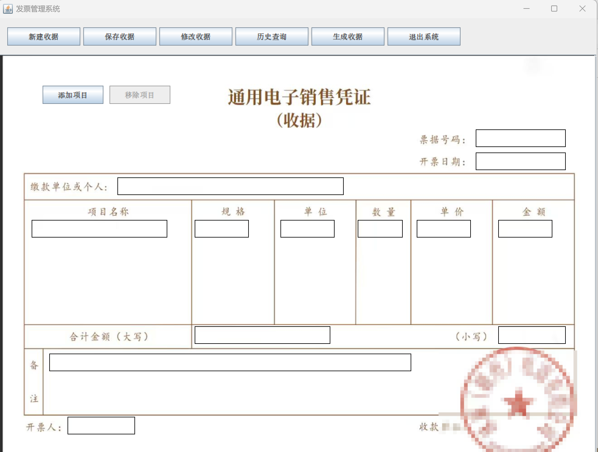

# 收据管理系统 (Receipt Management System)

一个基于 **Java Swing** 开发的桌面收据管理工具，支持用户登录、收据填写、金额自动转换大写、历史记录保存、生成图片/PDF 等功能。

 

##  功能特点

-  **用户管理**：注册、登录、记住密码、密码重置（随机生成新密码）。
-  **收据填写**：可视化收据模板，支持多个项目（最多4个），自动计算金额小计和合计。
-  **金额转换**：小写金额自动转换为中文大写（如“壹仟贰佰叁拾肆元伍角陆分”）。
-  **数据持久化**：收据数据保存到本地文件（`receipt_data.dat`），用户信息保存到 `users.txt`。
-  **生成收据图片/PDF**：将填写的收据渲染为高清 PNG/JPG 图片或 PDF 文档，支持选择保存格式和自定义文件名。
-  **历史记录**：查看所有已保存收据的列表，支持双击修改。
-  **智能默认值**：自动生成票据号码（日期+序号），自动填充当前日期。

##  技术栈

| 类别       | 技术                          |
| ---------- | ----------------------------- |
| 语言       | Java 11+                      |
| UI 框架    | Swing (JFrame, JPanel 等)     |
| PDF 生成   | iTextPDF                      |
| 图像处理   | Java ImageIO                  |
| 数据存储   | 本地文件（序列化 + 文本文件） |
| 构建工具   | 未使用 Maven（需手动管理 jar）|

##  如何运行

### 前提条件
- JDK 11 或更高版本
- 依赖 JAR 包：iTextPDF（用于生成 PDF）

### 步骤
1. **克隆项目**
   ```bash
   git clone https://github.com/你的用户名/仓库名.git
   cd 仓库名
   ```

2. **添加依赖**  
   下载 `itextpdf-5.x.x.jar` 并放入项目根目录的 `lib/` 文件夹（如没有则创建）。  
   或在 IDE 中通过库管理添加。

3. **在 IDE 中运行**  
   - 用 IntelliJ IDEA / Eclipse 打开项目。  
   - 确保 `shouju.Main` 类包含 `public static void main` 方法。  
   - 运行 `shouju.Main`。

4. **或通过命令行编译运行**（需手动设置 classpath）
   ```bash
   javac -cp ".;lib/*" shouju/*.java shouju/controller/*.java shouju/model/*.java shouju/view/*.java
   java -cp ".;lib/*" shouju.Main
   ```

> **注意**：首次运行时，`users.txt` 和 `receipt_data.dat` 会自动创建。默认无预置账号，需点击“注册账号”创建。

##  项目结构

```
src/
├── shouju/
│   ├── Main.java                    # 程序入口（启动登录窗口）
│   ├── controller/
│   │   └── AuthController.java      # 登录/注册/重置密码逻辑
│   ├── model/
│   │   ├── User.java                # 用户实体
│   │   ├── UserDatabase.java        # 用户文件读写（users.txt）
│   │   ├── UserLoginInfo.java       # 记住密码记录实体
│   │   ├── Receipt.java             # 收据实体（已定义但未使用）
│   │   └── ChineseNumberConverter.java # 金额转中文大写
│   └── view/
│       ├── LoginPanel.java          # 登录界面
│       ├── RegisterPanel.java       # 注册界面
│       ├── ForgotPasswordPanel.java # 找回密码界面
│       ├── Main.java (view)         # 主界面（收据编辑窗口）
│       ├── ImagePanel.java          # 收据绘制面板（核心）
│       ├── ReceiptHistoryDialog.java   # 历史记录弹窗
│       ├── ReceiptSelectionDialog.java # 选择收据弹窗（修改用）
│       └── resources/
│           └── image.png            # 收据背景模板
```

##  操作说明

| 操作 | 效果 |
|------|------|
| **登录/注册** | 首次使用需注册，支持记住密码、重置密码（随机新密码）。 |
| **新建收据** | 清空所有字段，自动生成当前日期和票据号码（日期+3位序号）。 |
| **填写项目** | 支持最多4个项目，填写名称、规格（可选）、单位、数量、单价，自动计算金额。 |
| **保存收据** | 校验必填字段后保存到 `receipt_data.dat`，票据号码不可重复（可覆盖）。 |
| **修改收据** | 从历史记录中选择收据，加载到表单进行修改。 |
| **生成收据** | 将当前收据渲染为图片（PNG/JPG）或 PDF，可选择保存格式和路径。 |
| **历史查询** | 弹出对话框展示所有收据的简要列表。 |
| **退出系统** | 关闭程序。 |

##  待改进

- [ ] 支持自定义收据模板（背景图片可动态更换）
- [ ] 增加收据打印功能（直接连接打印机）
- [ ] 导出收据为 Excel 报表
- [ ] 改用 SQLite 数据库替代文件存储，支持更高效查询
- [ ] 添加项目删除按钮（目前只能通过覆盖或清空）
